# 智能焊接抽烟机软件流程图

## 1. 系统主流程图

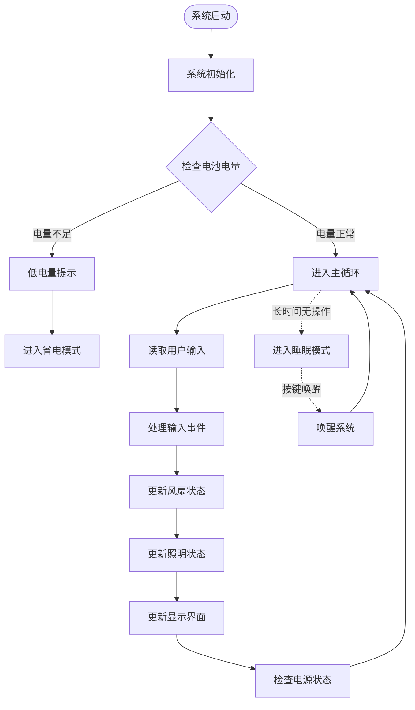

## 2. 风扇控制流程

### 2.1 自动模式流程

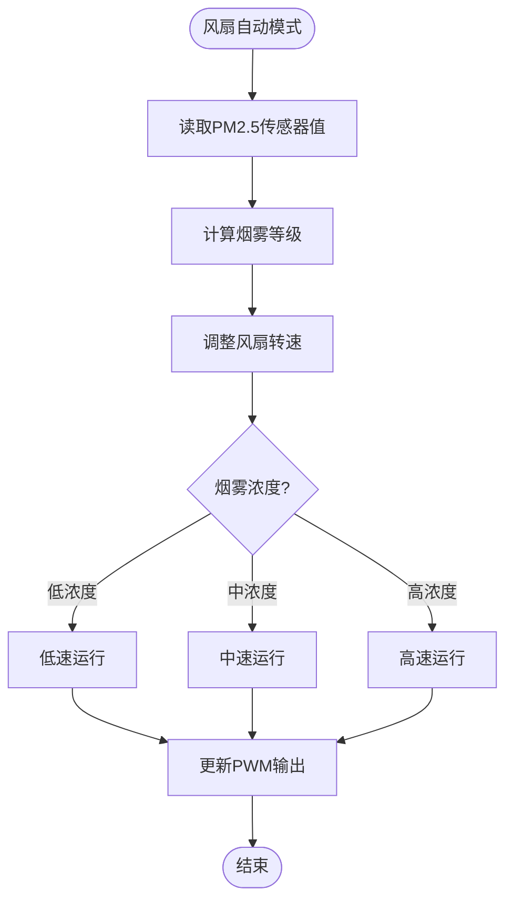

### 2.2 手动模式流程

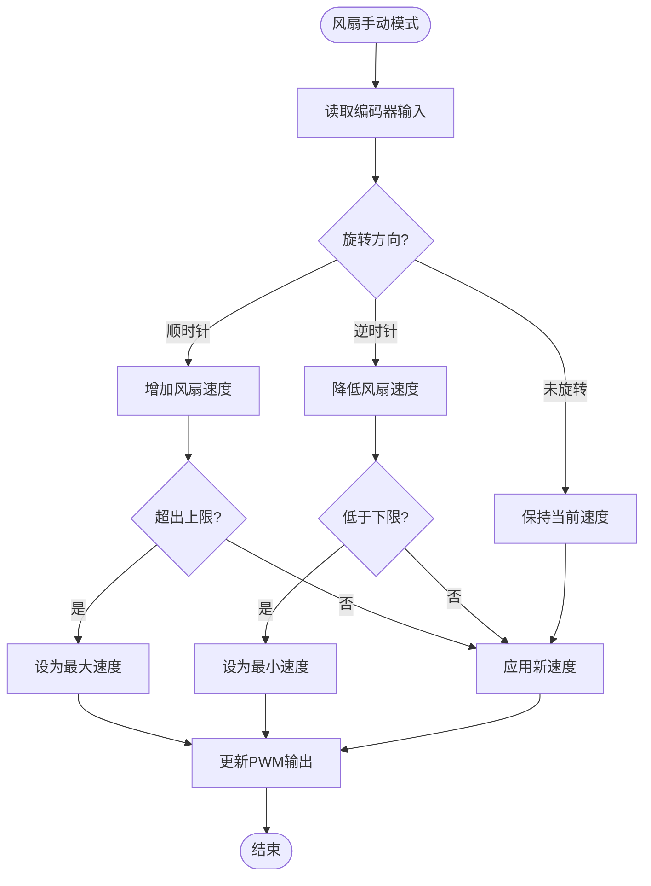

## 3. 灯光控制流程

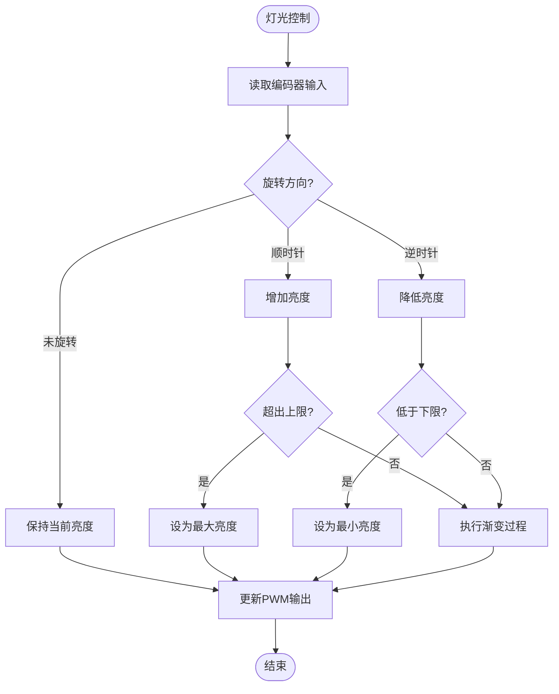

## 4. 用户交互流程

### 4.1 按键处理流程

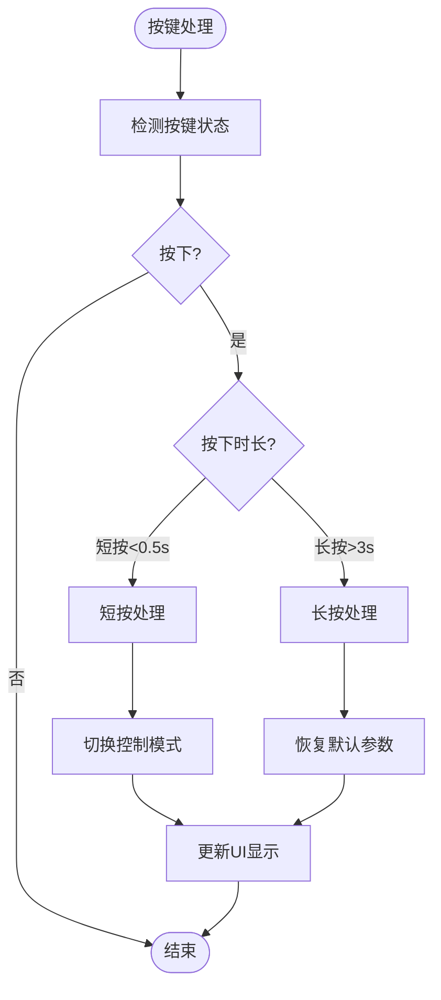

### 4.2 编码器处理流程

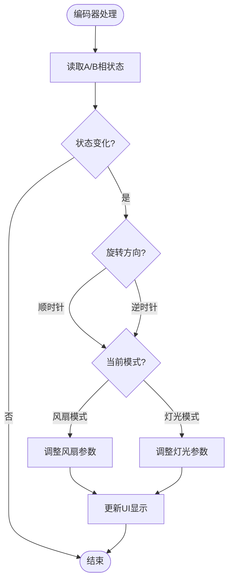

## 5. 电源管理流程

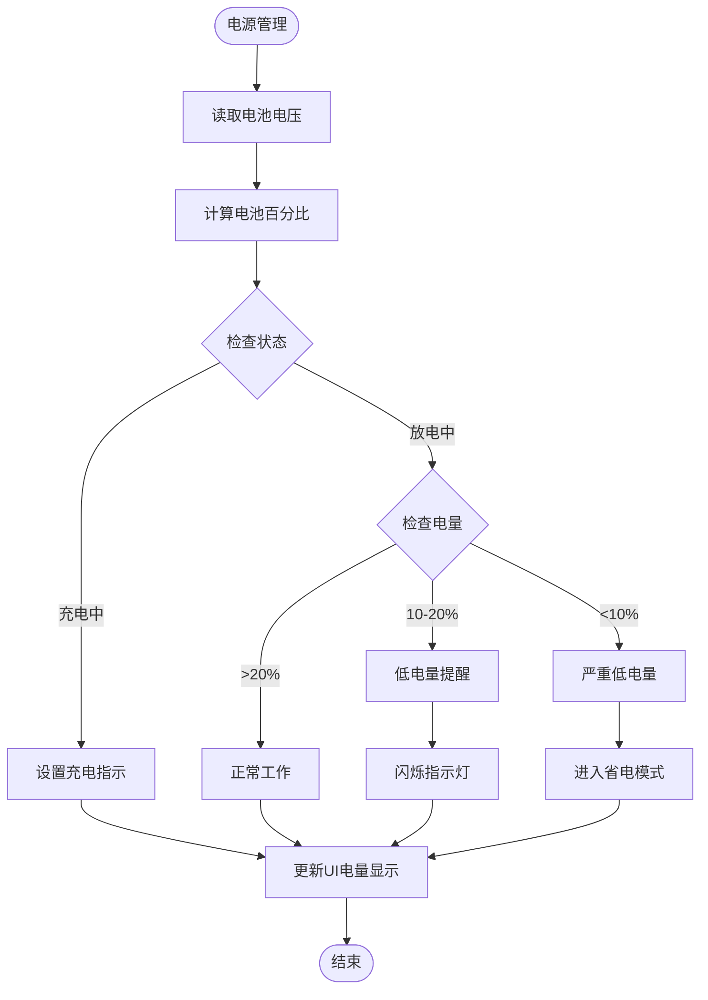

## 6. 显示控制流程

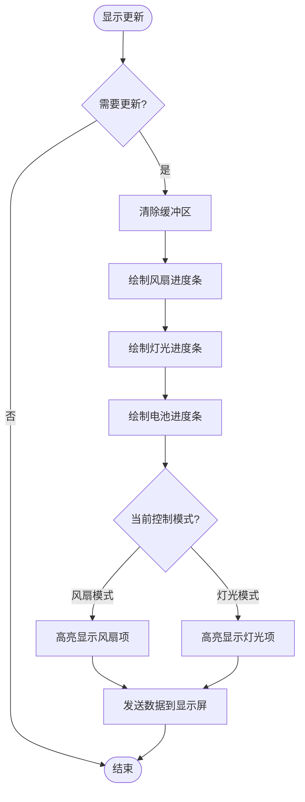

## 7. 软启动流程

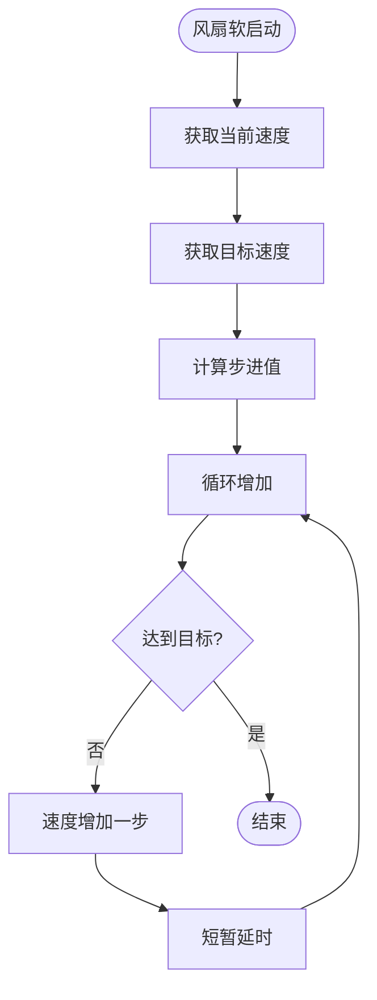

## 8. 错误处理流程

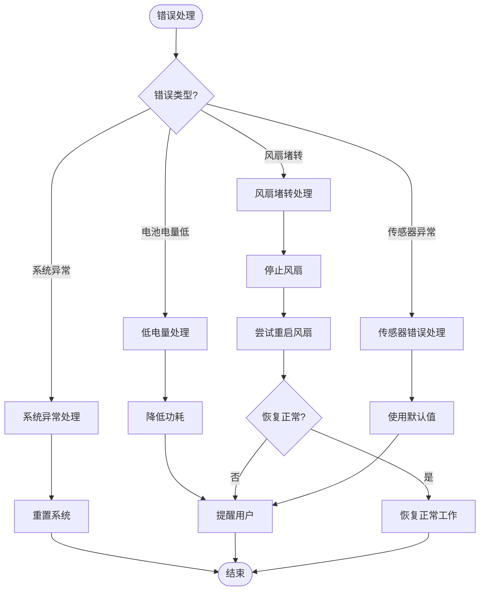

## 9. 初始化流程

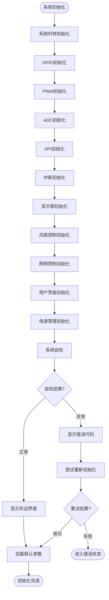

## 10. 状态机流程

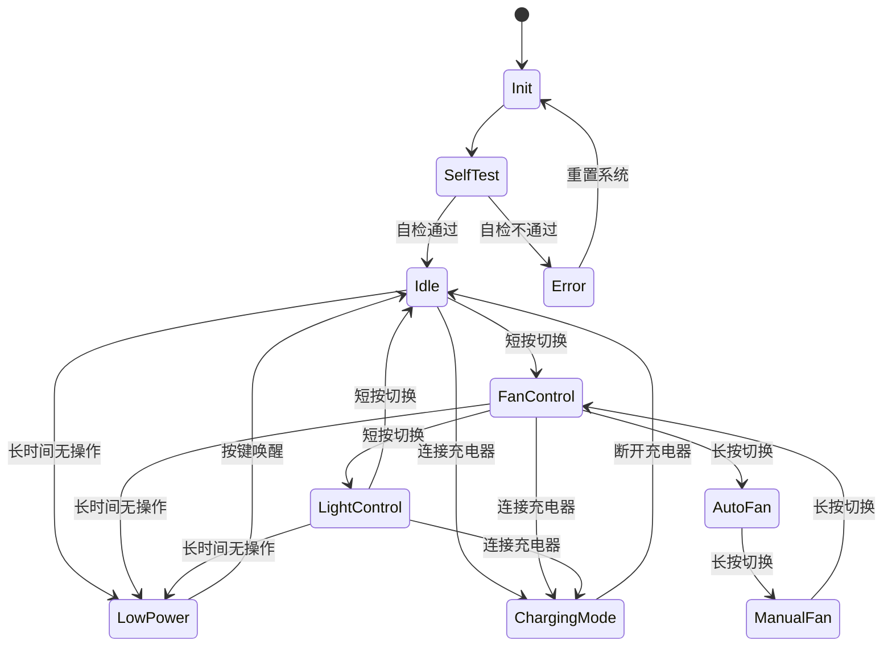

## 11. 总结

以上流程图全面覆盖了智能焊接抽烟机的软件工作流程，包括主要的控制逻辑、用户交互处理、错误处理以及各模块的详细工作流程。这些图表可以作为软件开发的指导，确保系统功能的完整实现。在实际开发过程中，可以根据硬件特性和用户反馈进行优化和调整。 