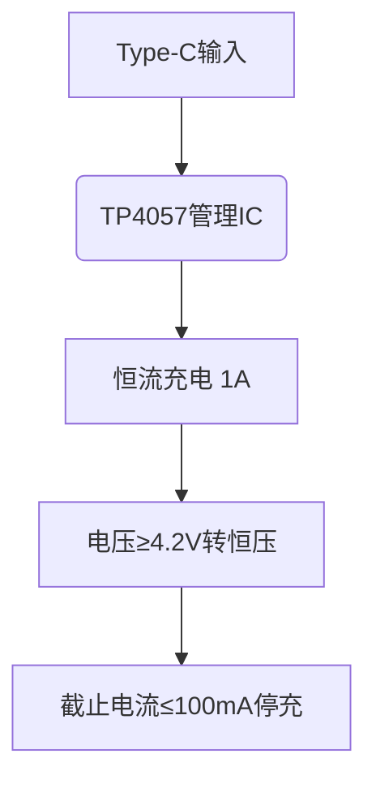

# 智能焊接抽烟机产品需求文档（PRD）

## 1. 产品概述
便携式多功能焊接辅助设备，集成烟雾抽排、无影照明、磁吸定位三大核心功能，解决焊接场景下的健康防护与操作便利性问题。

## 2. 核心功能需求

### 2.1 智能抽烟系统
| 指标项       | 技术参数                          | 补充说明                     |
|--------------|-----------------------------------|------------------------------|
| 风扇类型      | 双滚珠轴承直流风扇（12V/200mA）  | 需提供噪音＜45dB的型号选项   |
| 风道设计      | 螺旋集烟罩+可拆卸滤网            | 滤网需支持水洗重复使用       |
| 调节方式      | 双模式：<br>• 自动模式（基于PM2.5传感器）<br>• 手动无级调速（200-2000rpm） | 自动模式下响应时间＜3秒      |

### 2.2 专业照明系统
| 组件          | 规格要求                                              |
|---------------|-------------------------------------------------------|
| LED光源       | 显色指数≥90，色温5000K±10%，光通量≥800lm            |
| 光学设计      | 蜂窝状均光板+120°广角透镜                             |
| 调光范围      | 10%-100%无级调节，支持PWM调光（频率＞1000Hz防频闪）  |

### 2.3 人机交互
**控制逻辑：**
1. 短按功能键（0.5s）：切换风扇/灯光控制模式
2. 旋转编码器：调节当前模式参数
3. 长按功能键（3s）：复位默认参数

**显示屏UI规范：**
```
┌───────────────────────┐
│ FAN:■■■■□□ 75%        │
│ LIGHT:■■■□□□ 60%      │
│ BAT:■■■■■□□ 82%       │
└───────────────────────┘
```
采用分段式进度条显示，刷新率≥5Hz

## 3. 结构需求

### 3.1 磁吸系统
| 参数       | 要求                          |
|------------|-------------------------------|
| 磁力规格   | 钕磁铁N35级，单点吸附力≥3kgf  |
| 万向调节   | 支持球头关节±15°角度锁定      |

### 3.2 三防要求
| 参数       | 要求                          |
|------------|-------------------------------|
| 防护等级   | IP54防护等级（防尘防溅水）    |
| 外壳材料   | 阻燃ABS+硅胶防震包边          |

## 4. 电源管理系统

### 4.1 电池配置
| 参数       | 规格                          |
|------------|-------------------------------|
| 电芯类型   | 21700锂离子电池×2（并联）     |
| 标称容量   | 5000mAh/3.7V                 |

### 4.2 续航能力
- 满负荷（风扇+灯光）：≥2h
- 节能模式：≥8h

### 4.3 充电特性


## 5. 可靠性要求
| 测试项目   | 验收标准                      |
|------------|-------------------------------|
| 高温老化   | 85℃环境下连续工作4小时        |
| 振动测试   | 5-500Hz随机振动3小时          |
| 按键寿命   | 5万次循环无失效               |

## 6. 合规性要求
- 电磁兼容：EN 61000-6-3
- 安规认证：UL 60745-1
- 环保认证：RoHS 2.0

## 7. 成本目标
| BOM分类    | 目标成本（千台量级）          |
|------------|-------------------------------|
| 电子部件   | ≤18.50                       |
| 结构件     | ≤9.80                        |
| 总装测试   | ≤5.20                        |
| 合计       | ≤33.50                       |

## 版本记录
| 版本       | 日期        | 修改说明           |
|------------|-------------|-------------------|
| v1.0       | 2023-08-25  | 初始版本          |
| v1.1       | 2023-08-27  | 补充EMC测试要求   |

---

## 附录
该文档采用模块化结构设计，包含：
1. 参数表格化呈现关键指标
2. 交互逻辑的时序说明
3. 可视化UI示例
4. 成本分解明细
5. 版本控制记录

可根据实际开发阶段需求扩展测试用例附录、接口定义等章节